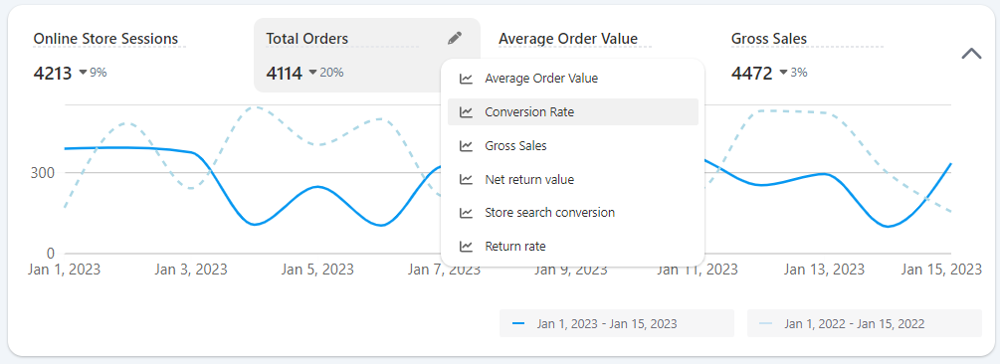
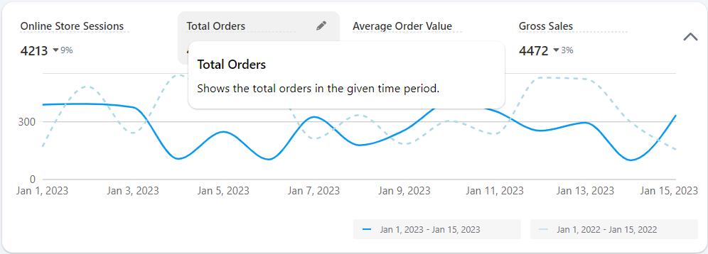
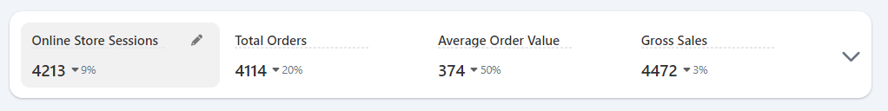
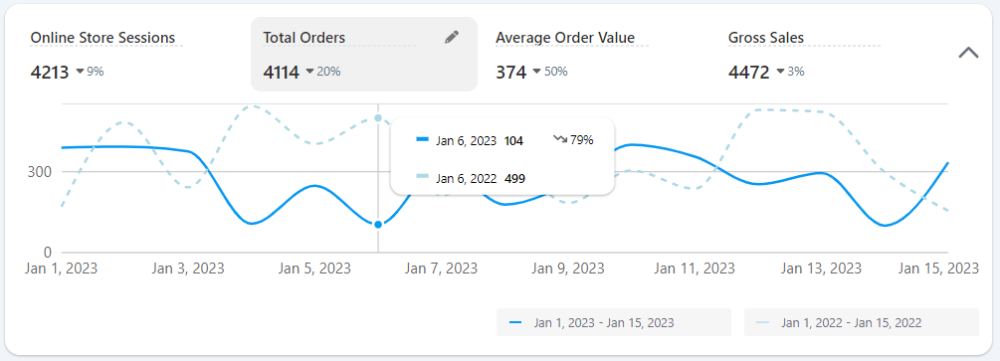

# Marble-Assignment-Documentation

<div align="center" style="margin: 30px;">
    <a href="https://refine.dev">
    
    </a>
</div>
<br/>

View the live demo [here](https://marble-assignment.onrender.com/) [Source Code](https://github.com/VishalMX3/Marble-Assignment/tree/main).

### Running the development server.

```bash
    npm run dev
```

## My Approach

Refine was new to me, so I started by reading its [guide](https://gomarble-dot-yamm-track.appspot.com/25g97UkIjPoQAT2pes4b8Vu2aDIGT5M26yTSAXi92q85JDGTPjQE3wTtbo_1Rtn_rssmL2XfwQdTsZRMsD7-mn8PuQsnkpEDtq5yGZcTWNzfBsLbpZMSPQwUh-vxMVENBC5mv4b9OaSB7mmffMM6T9vavv6ilhaMb3oCvHU7G2-VQXJNCZm-DFdX736go5rVDIWhTKQ8WmcsDEk2bpBWuAPkoss-ROp8p).✨

I built the React dashboard and admin panel with Refine and daisyUI along with the guide. This helped me understand the working and syntax of Refine. Then I started modifying the template according to the need of assignment.

## Assumptions made:

I have assumed that there are API endpoints say (/`totalOrders`, /`onlineStoreSessions`, /`averageOrderValue` and /`grossSales`) in backend which can provide me with json data in the following form:

```tsx
{
  "data": [
    {
      "date": "2024-02-14T00:00:00.000Z",
      "value": 41
    },
    {
      "date": "2024-02-15T00:00:00.000Z",
      "value": 35
    },
  ]
}
```

## Generating Mock Data →

Written a function `generateMockData` in `mockData.ts` file which takes in `minValue`, `maxValue`, `startDate` and `endDate` (in **YYYY-MM-DD** format) - as parameters to generate mock data between the start Date and end date with values ranging between `minValue` and `maxValue`.

```tsx
interface DataObject {
  date: string;
  value: number;
}

// Function to generate random value between min and max (inclusive)
function getRandomValue(min: number, max: number): number {
  return Math.floor(Math.random() * (max - min + 1)) + min;
}

// Function to generate mock data f
export function generateMockData(
  minValue: number,
  maxValue: number,
  startDate: Date,
  endDate: Date
): { data: DataObject[] } {
  const mockData: { data: DataObject[] } = { data: [] };

  // Loop through each day from start to end date
  for (
    let date: Date = new Date(startDate);
    date <= endDate;
    date.setDate(date.getDate() + 1)
  ) {
    // Generate random value for the day
    const value: number = getRandomValue(minValue, maxValue);

    // Add date and value to the mockData
    mockData.data.push({
      date: new Date(date).toISOString(),
      value: value,
    });
  }

  return mockData;
}
```

I used the above function to generate mock data for a fixed (hard-coded) time-period and also to get previous year data (Assuming 1 year gap comparision). We can now use the below code in other components to get the required data.

```tsx
import { generateMockData } from "../../mockData";

const mockData = generateMockData(
  1,
  50,
  new Date("2023-01-01"),
  new Date("2023-01-15")
);

const mockDataPrev = generateMockData(
  1,
  50,
  new Date("2022-01-01"),
  new Date("2022-01-15")
);
```

**Later, the hard coded dates could be replaced by user chosen dates, to write the logic for date picker object.**

## Logic I used for previous year comparision line

Let's take an example of **Total Orders**. I created mock data using the above implementation. Both for the selected time period and same time period 1 year back.

Both of these mock datas are now passed to two functions `useMemoizedChartData` and `mergeData`.

```tsx
const mergedTotalOrdersMockData = mergeData(
  useMemoizedChartData(totalOrdersMockData),
  useMemoizedChartData(totalOrdersMockDataPrev)
);
```

`useMemoizedChartData` function formats the date to be readable and also memoize the data so that there are no recalculations.

`mergeData` merges the data for a particular date with its `currentValue` and `previousValue`.

Now the `mergedTotalOrdersMockData` is in the below format:

```tsx
"data":
    {
    "previousValue": "230"
    "date": "Jan 1, 2023",
    "currentValue": "300"
    },
```

Now this `mergedTotalOrdersMockData` is passed to `ResponsiveLineChart` component.

**Note: the type accepted by `ResponsiveLineChart` is also updated with `IChartDatum2` which is according to the format in `mergedTotalOrdersData`.**

Now we can easily create two lines:

```tsx
        <Line
          type="monotone"
          dataKey="currentValue"
          stroke={colors?.stroke}
          strokeWidth={2}
          fill={colors?.fill}
          dot={false}
        />

        <Line
          type="monotone"
          dataKey="previousValue"
          stroke="lightblue"
          strokeDasharray="5 5"
          strokeWidth={2}
          fill="rgba(173, 216, 230, 0.2)"
          dot={false}
        />
```

The above process is repeated for rest of the metrics.

For styling the chart, I used the [documentation](https://recharts.org/en-US/api/LineChart) from recharts.

## Screenshots of working Application








